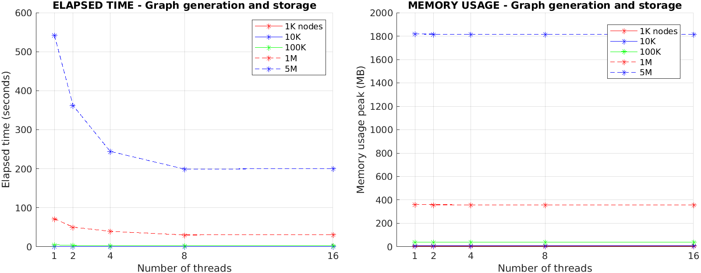
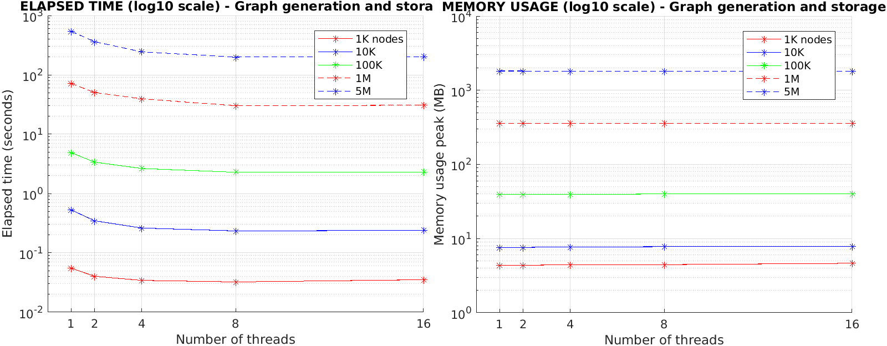
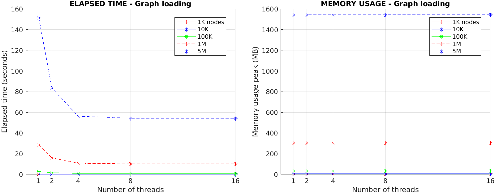
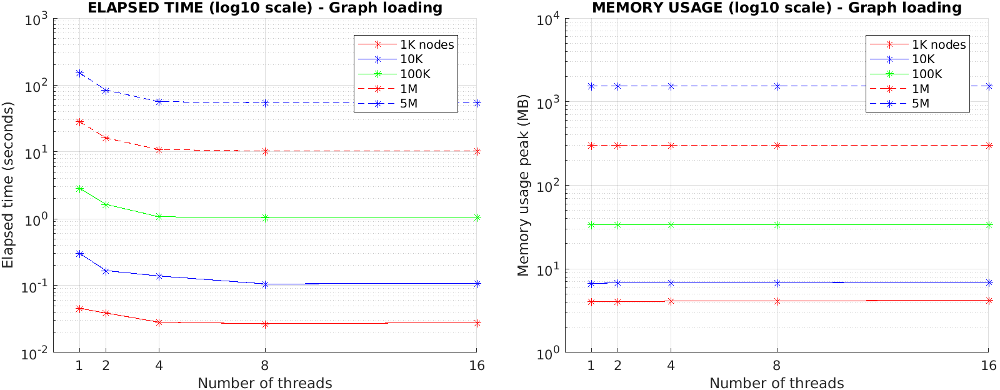
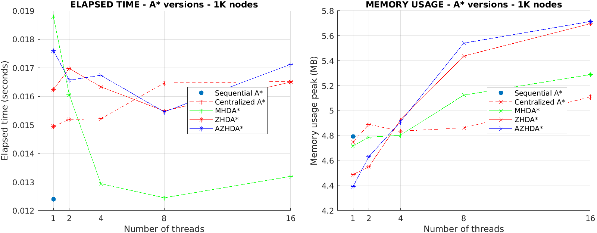
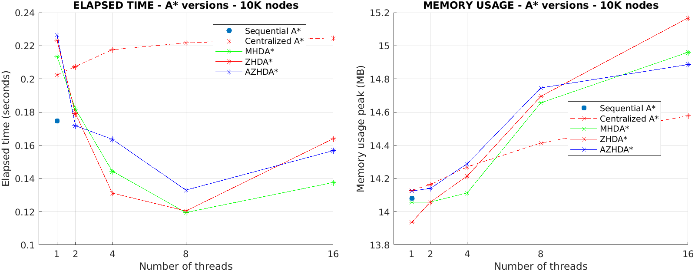
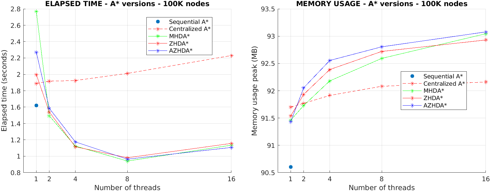
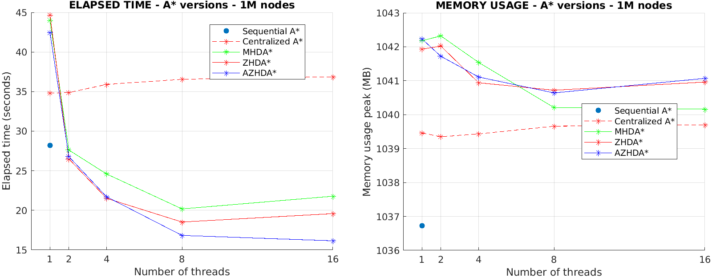
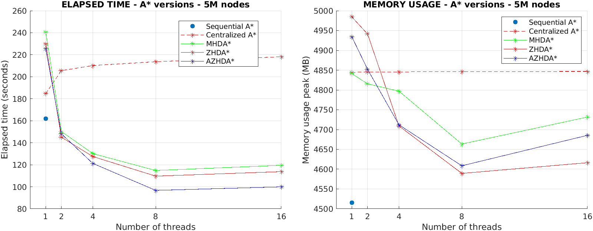
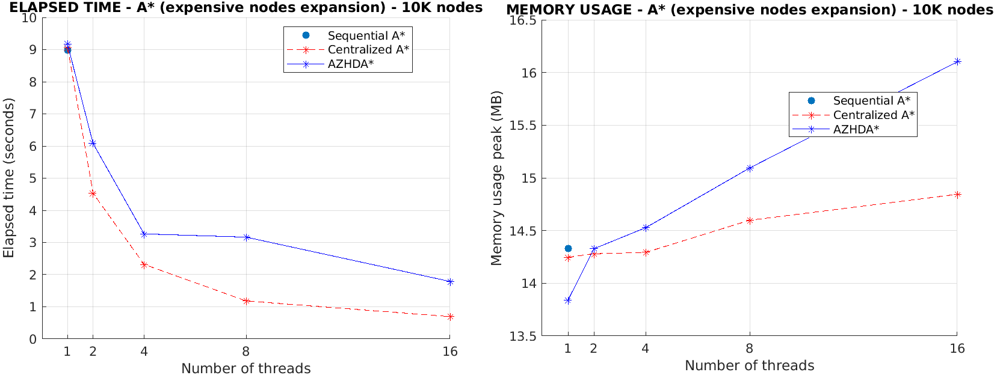

# A* algorithm project
Authors: Paoli Leonardi Francesco (s297078), Pasqualini Federico (s296488)


\
A* is a path search algorithm for finding the optimal-cost path that connects any `start` node to any `stop` node of a directed, weighted graph (if such path exists).
The following documentation aims to guide the user through the C/C++ implementation of single-thread and multi-thread versions of A* algorithm, highlighting the main design choices that have been made and the experimental results that have been achieved.


# 1. Graph data structures and algorithms design

For a better understanding of the documentation, the main notations used to describe the algorithm design procedure have been reported below:
- `graph`: set of nodes connected between them by directed, weighted links.
- `Node`: data structure representing the graph nodes (more details on this later).
- `start` and `stop`: source and destination nodes of the A*, respectively.
- `neighbors` of a node: nodes to which the latter is connected through directed, weighted links.
- `g_cost` of a node: cumulative cost (i.e., weight) of all the links that have to be traversed from `start` in order to arrive at that node.
- `h_cost` of a node: estimation of the cost of the links that must be traversed from that node to arrive at `stop`, which is computed by an heuristic (more details on this later).
- `f_cost` of a node: `g_cost` + `h_cost` of that node.
- `num_nodes`: number of graph nodes
- `num_threads`: number of threads that are running concurrently.


## 1.1 Graph data structures

The first implementation choice was to represent a graph as a `std::vector` structure of `Node` objects, whose main features are reported below:
```c++
// set of links (and corresponding weights) that connect a node with its neighbors
typedef std::unordered_map<unsigned int, unsigned int> link_weight_umap;

/******************** Graph's nodes structure ********************/
class Node {

    unsigned int id;    // node's ID
    int x;              // node's coordinate along x axis
    int y;              // node's coordinate along y axis
    std::unique_ptr<link_weight_umap> neighbor;     // node's links to neighbor nodes
    …
};
```
where:
- `id` is the unique identifier of each node on the graph.
- `x` and `y` are the coordinates of the node on the 2D grid on which the graph is built.
- `neighbor` is a pointer to a `std::unordered_map` structure containing a set of key-value pairs representing the `id` of the nodes to which the `neighbor` structure owner is connected and the cost of the corresponding links, respectively.

_**Highlighted implementation choices**_:
- `neighbor` is a pointer to a `std::unordered_map` and not a `std::unordered_map` itself because we wanted each `Node` object to be of constant size.
- Each `Node` has been provided with full copy control features (i.e., constructor, copy/move constructor, copy/move assignment, destructor), overloaded operators and attributes getters/setters, which have been implemented in `graph_gen_store_load.cpp/.h` files.


## 1.2 Graph generation and storage
The first task was to implement a graph generation algorithm in order to generate a graph (having up to millions of nodes and links) and to store it in a file, from which it can then be retrieved whenever needed.
Considering the potentially huge size of the graph, it has been decided to implement the algorithm in a parallel way, so that it could be executed both in single-thread and multi-thread.
Through the user interface provided by `menu.cpp/.h` files, the user can choose to run the program in order to generate a random graph of a given size (i.e., number of nodes), as well as the number of threads that should concurrently generate the graph’s nodes and links and store them in a long-term memory file.


### 1.2.1 Details about the graph generation procedure
The function `graph_generation` called by the main thread initializes all the data structures and synchronization primitives needed for the graph generation and then, for each thread that has to run concurrently, an instance of the function `nodes_links_generation` gets launched in order to generate the graph in parallel. Both above mentioned functions are in `graph_gen_store_load.cpp/.h`.

For efficient threads synchronization, the following primitives have been employed:
- `std::mutex` structures to manage critical code sections that need to be mutually exclusive.
- `pthread_mutex_t` and `sem_t` structures to implement barriers that allow all threads to “re-align” in a given point in code execution before proceeding further.
- `std::atomic_flag` to allow threads to lock certain graph partitions that divide the original graph in order to guarantee efficient thread parallelism.  

_**Highlighted implementation choices**_:
- To let threads lock graph partitions, `std::atomic_flag` structures were employed instead of `std::mutex` because, when a certain partition gets locked and “processed” by a thread, the same partition doesn’t need to be processed by any other thread, hence the `std::atomic_flag::test_and_set` method was used for this purpose. The same could be done by `std::mutex::try_lock` method that, however, according to the C++ reference documentation (https://en.cppreference.com/w/cpp/thread/mutex/try_lock) is allowed to fail spuriously: _\<\<This function is allowed to fail spuriously and return false even if the mutex is not currently locked by any other thread.\>\>_.


### 1.2.2 Nodes generation
At the beginning of nodes generation, the graph `x`-`y` coordinate space gets evenly divided in a certain number of partitions such that it becomes a 2D square grid where each grid cell is a graph partition having certain `x`-`y` bounds. The number of created partitions is proportional to `num_nodes` and gets computed by the `optimal_graph_axes_partit_size` function in `utilities.cpp/.h` files.

Then, all threads run concurrently to lock graph partitions and, when one gets locked, the corresponding thread generates inside it a certain number of nodes having `x` and `y` coordinates within the partition boundaries. The number of nodes inside each partition gets calculated such that, at the end, the overall number of nodes will be equal to the `num_nodes` specified by the user.

_**Highlighted implementation choices**_: 
- `optimal_graph_axes_partit_size` function computes the optimal `graph_axes_partit` (i.e., number of graph partitions to be created along `x` and `y` coordinates) in order to have the least overall number of links in the graph to be generated. This is just an implementation choice made in order to obtain a graph where it is “challenging” to find a path between two nodes and to reduce the time needed for the graph generation, but any choice of `graph_axes_partit` strictly greater than zero is totally fine.
- Excluding cases in which `num_threads` is greater than `num_nodes` (which is very unusual), the number of graph partitions is sufficiently greater than `num_threads` so that faster threads can lock multiple partitions and slower threads don’t become the bottleneck, but it is also not too big in order to avoid excessively increasing the overhead due to threads parallelism.


### 1.2.3 Links generation

Each thread waits on a barrier for all the others to finish the nodes generation and, when all threads are done, they go through all the graph partitions a second time in order to generate the links of the nodes belonging to each partition.

Links get created between nodes both belonging to the same graph partition and belonging to different but adjacent partitions. In order to decide the number of links to be generated and their weight, the following arbitrary choices have been made:
- The number of links between nodes belonging to the same graph partition is random and proportional to the `log2` of the number of nodes inside that partition.
- The number of links going from the nodes of a partition _A_ to the nodes of another partition _B_ adjacent to _A_ is deterministic and proportional to the `sqrt` of the number of nodes inside partition _B_.
- The weight of each link is equal to the Euclidean distance on the `x`-`y` plane between the two nodes that the links connect, multiplied by a random `float` coefficient between 1 and 2.

_**Highlighted implementation choices**_:
- It has been chosen to generate at least one incoming link and one outgoing link for every node, so that the resulting graph is strongly connected. Therefore, the proposed graph generation algorithm creates graphs for which there always exists a path between every `start` and `stop` node pair.


### 1.2.4 How the graph gets stored in long-term memory

When all threads are done with the links generation as well (which is guaranteed by a barrier), the graph data structure can be serialized (i.e., stored) into the file specified by the user through the terminal command window. The graph serialization gets performed in binary format through the `write` system call, so that the graph structure occupies less bytes in the disk.

The main steps of the graph storing algorithm are the following:
1. One thread stores at the beginning of the file the information about nodes and links, which are:
* 4 bytes `unsigned int` for the number of generated nodes.
* 4 bytes `unsigned int` for the number of generated links.
* 4 bytes `unsigned int` for the number of graph partitions.
* For each graph partition, 4 bytes `unsigned int` for the number of links that start from that partition.
2. Threads concurrently go through every graph partition and, for each of them, store in the file the information about each node of that partition, which are:
* 4 bytes `unsigned int` for the node `id`.
* 4 bytes `int` for the node `x` coordinate.
* 4 bytes `int` for the node `y` coordinate.
3. Same as step 2., but now threads store in the file the information about the links of each node of graph partitions, which are:
* 4 bytes `unsigned int` for the `id` of the node from which the link starts.
* 4 bytes `unsigned int` for the `id` of the node in which the link ends.
* 4 bytes `unsigned int` for the link’s weight.


_**Highlighted implementation choices**_:
- In order to preserve the correctness of the content that gets written into the file, the three steps mentioned above are separated by thread barriers.
- `lseek` and `fcntl` system calls have been employed to, respectively, locate the exact file region where to write and to ensure that, when a thread is writing on a certain file region, no other thread is allowed to write on the same region.
- Each thread, after writing something in the file, checks the return value of the `write` system call in order to guarantee that the number of written bytes is actually correct.


## 1.3 Graph loading
Once the algorithm for generating the graph and storing it in a file has been completed, it was necessary to implement a second algorithm that, given the name of a file storing a graph in the long-term memory, is able to rebuild it from the information stored in the file and to load it in the memory of the running program, so that A* could be executed on it.
As for the graph generation, considering the potentially huge size of the graph, it has been decided to implement the graph loading algorithm in a parallel way, so that it could be executed both in single-thread and multi-thread.
Through the user interface provided by `menu.cpp/.h` files, the user can choose to run the program in order to load a graph from a file by specifying the number of threads that should concurrently read the graph’s nodes and links from the files. During this process, the user gets also asked about which A* algorithm versions should be run on the graph after it gets successfully read (more details on this later).


### 1.3.1 Details about the graph loading procedure
The function `graph_read_from_file` called by the main thread initializes all the data structures and synchronization primitives needed for the graph loading and then, for each thread that has to run concurrently, an instance of the function `nodes_links_read_from_file` gets launched in order to read the graph in parallel. Both above mentioned functions are in `graph_gen_store_load.cpp/.h`.

For efficient threads synchronization, the same primitives already discussed in [Section 1.2.1](#121-details-about-the-graph-generation-procedure) have been employed.

The deserialization of the graph information contained in the file is performed by following the same protocol used for the serialization of graph in file, whose details are described in [Section 1.2.4](#124-how-the-graph-gets-stored-in-long-term-memory). In particular:
1. The main thread reads the information related to the number of nodes and links at the beginning of the file.
2. All threads concurrently go through every graph partition and, for each of them, read from the file the information related to each node of that partition.
3. Same as step 2., but now threads read from the file the information related to the links of each node of graph partitions.

As for the graph generation, each of the above steps of the graph loading gets performed by:
- locking through the `fcntl` system call the file regions that are currently being read by a thread.
- checking every time the return value of the `read` system call to ensure that the correct number of bytes have been actually read from the file.

Once this procedure has been carried out successfully, the graph will be found in a `std::vector<Node>` that is ready to be used by the A* algorithm.


# 2. A* data structures and algorithms design
Considering the state-of-the-art approaches for A* carried out in the literature of path search algorithms [[1](#references)] [[2](#references)], it has been decided to implement 3 different versions of the A* algorithm, of which one is single-thread and the other two allow multi-thread execution:
- `Sequential A*` that is the classical A* algorithm running on a single thread.
- `Centralized A*` that runs on multiple threads but all the data structures are shared between them and protected by appropriate synchronization primitives.
- `Decentralized A*` that is a highly optimized parallel version where each thread has its own data structures, so that locks and resources shared among all threads are reduced as much as possible.

Through the user interface provided by `menu.cpp/.h` files, the user can choose which A* versions should be run on the graph, as well as their execution parameters (e.g., `start` and `stop` nodes, `num_threads` for the Centralized and Decentralized A*, hashing method for the Decentralized A*).

Details about each one of the above mentioned versions can be seen in the `a_star.cpp/.h` files and are presented in following sections.


## 2.1 Sequential A*
The Sequential A*, as the name suggests, runs on a single thread in a sequential way, so that graph nodes are explored one at a time until the best path (i.e., the path with the least cost) between `start` and `stop` nodes is found.


### 2.1.1 Sequential A* data structures
The following is a list of the main data structures exploited by the Sequential A* in order to carry out a correct algorithm execution:
- `graph`: a `std::vector<Node>` instance that represents the graph on which we want to run the A*.
- `start` and `stop`: nodes of `graph` between which we want to find the best path.
- `best_path`: object where the best path information will be stored, i.e., the sequence of nodes that makes up the path, how many these nodes are and the overall cost of the path. It is an instance of the `graph_path_t` data structure, which is defined as follows:
```c++
// set of nodes in a graph's path (the order in which the nodes must be traversed is given by the key of the hash map)
typedef std::unordered_map<unsigned int, Node> path_umap;

/******************** Path (i.e. sequence of nodes) of the graph ********************/
typedef struct graph_path_s {

    std::unique_ptr<path_umap> path_ptr;    // path itself
    unsigned int path_num_nodes;            // number of nodes contained in the path
    std::atomic<int> path_cost;             // path's overall cost

} graph_path_t;
```

- `open`: a `std::priority_queue` instance that stores the nodes that still need to be visited, together with their `f_cost` and `h_cost`. Each `open` list entry has the following structure:
```c++
// tuple that, given a node 'N', stores f(N), h(N) and N itself
typedef std::tuple<double, double, Node> list_elem;
```

- `closed`: a `std::unordered_map` instance used to keep track of nodes that have been already visited. Its key-value pairs are made out of, respectively, the `id` of the nodes and their corresponding `list_elem` structure, which is shown above.
- `from`: a `std::unordered_map` instance having as key-value pairs a `Node` (called _child_ node) and its parent (i.e., the node from which we arrived at the child node), respectively. It is used to keep track of the current best path from `start` to `stop`. It will be read at the end to reconstruct the whole path.
- `cost`: a `std::unordered_map` instance having as key-value pairs a `Node` and an `unsigned int` representing the current best cost to arrive at it, respectively.


_**Highlighted implementation choices**_:
- For the `open` structure it has been chosen to use a `std::priority_queue` because it allows fast insertion and fast removal of the lower cost node (both with _O(1)_ complexity), which is what is needed. As a drawback, `std::priority_queue` doesn't allow random access (i.e., doesn’t allow editing nodes already inserted in it), so we cannot update the cost of a node when we find a lower cost path to arrive at it. However, a simple and effective workaround of this is to just duplicate the node in the `open` list with different costs and, thanks to the `std::priority_queue` properties mentioned above, it is guaranteed that the node copy having the lower cost will be always picked up first, and all other duplicates of the same node will be discarded when it's their turn to be removed from the `open` list (we keep track of the nodes already expanded in the `closed` list).
- The heuristic used to compute the `h_cost` of each node is the Euclidean norm because, besides its simplicity, it is an admissible heuristic (i.e., it never overestimates the distance to the `stop` node) and a consistent heuristic (i.e., satisfies the triangle inequality). An admissible and consistent heuristic guarantees that, when a node gets expanded for the first time, it will be with the lowest possible cost. This statement also implies that, when the Sequential A* reaches for the first time the `stop` node, then the algorithm can terminate because it is for sure the path with the lowest cost. However, the above discussion stands in general only for the Sequential A* and _not_ for the Centralized and Decentralized A* (more details on this later).
- For the `closed`, `from` and `cost` structures we chose the `std::unordered_map` data type because we wanted constant computational complexity to perform random access on them.


### 2.1.2 Details about the Sequential A* implementation
The sequential implementation of A* is straightforward: starting from the user specified `start` node, a single thread progressively expands all the lowest cost neighbors of the already visited nodes, until the `stop` node is eventually found.

The main algorithm steps are described below:
1. Extract from the top of the `open` list the node that is currently reachable with the lowest cost.
2. Check if the extracted node is already in the `closed` list: if yes then discard it (we already visited that node with a lower cost), otherwise expand it and continue.
3. Check if the expanded node is `stop`: if yes then the algorithm terminates and the `rebuild_path_single_thread` function gets called in order to rebuild the path going backward from `stop` to `start`, otherwise continue.
4. For each neighbor of the node just expanded, check if that neighbor is worth expanding too: if yes then add it to the `open` list, otherwise discard it.
5. Loop through the steps 1-4 until the `stop` node is found or until there are no more nodes in the `open` list to be expanded. The latter circumstance would mean that there exists no path that connects `start` to `stop`.


## 2.2 Centralized A*

The Centralized A* is the most intuitive attempt to parallelize the Sequential A*. It relies on common data structures that are shared among all running threads, exploited by them in order to concurrently search for the lowest cost path between `start` and `stop` nodes.


### 2.2.1 Centralized A* data structures
Other than the ones used by the Sequential A*, the Centralized A* version exploits the following main data structures:
- `end`: a `std::vector<int>` instance used to determine whether the algorithm must terminate or continue (more details on this later).
- `m0`, `m1` and `m2`: locks used in order to synchronize the threads' access to the shared data structures.


### 2.2.2 Details about the Centralized A* implementation
The Centralized A* runs multiple threads that progressively update their centralized knowledge of the graph by expanding all the lowest cost neighbors of the already visited nodes, until the `stop` node is eventually found.

The main algorithm steps are very similar to the ones of the Sequential A* (see [Section 2.1.2](#212-details-about-the-sequential-a-implementation)) but with 2 key differences:
1. Since data structures can now be accessed concurrently by multiple threads, they need to be properly protected. For this reason, we had to add 3 `std::mutex` instances:
- `m0` for synchronizing the access to `open` and `end` structures.
- `m1` for synchronizing the access to `from` and `cost` structures.
- `m2` for synchronizing the access to the `closed` list.
2. In the case of multithreaded execution, having an admissible and consistent heuristic for computing `h_cost` does _not_ guarantee anymore that the first found solution is the globally optimal one. Therefore, for the Centralized A* there is the need of an ad-hoc algorithm termination detection, which is presented in [Section 2.2.3](#223-centralized-a-termination-detection).


### 2.2.3 Centralized A* termination detection
Threads will continue to try to find a new best path solution until either they don't have any nodes left in the `open` list or the cost of all the nodes that can be expanded exceeds the cost of the current best path, in which cases the algorithm must terminate.

In order to properly detect such conditions we employed an `end` vector that, for each thread, stores a 0 or 1 if at least one of the above conditions is met for that thread or not, respectively.
Every time that the $i$-th thread recognizes that one or both the conditions are satisfied it sets `end[i]` to 0 and checks the values of all other `end` entries: if all entries are equal to 0 then the algorithm terminates, otherwise `end[i]` gets set back to 1 and the $i$-th thread continues.


_**Highlighted implementation choices**_:
- In order to reduce the overhead due to synchronization locks, we tried to minimize both the number of locks and the size (i.e., number of instructions) of the critical sections protected by those locks.


## 2.3 Decentralized A*

The Decentralized A* is a parallel implementation of the algorithm that aims at being more efficient and less time-consuming than the Centralized A* version by removing the overhead due to the locks and to the usage of common data structures shared among all threads.

To achieve this goal, each thread has its own `open` and `closed` lists and it runs the A* algorithm locally using those structures in such a way that the overall knowledge of the graph will be distributed (i.e., each thread will have information regarding only a sub-part of the explored graph) and _not_ centralized as it happens for the Sequential and Centralized A* versions.

In particular, the proposed algorithm implements the Hash Distributed A* (HDA*), a decentralized version of A* that evenly splits between threads the algorithm workload by relying on ad-hoc hash functions.

**NOTE**: from now on we will refer to a thread as the _owner_ of a node if the chosen hash function applied to that node returns the `id` of that thread. This means that the hashed thread is responsible for (eventually) expanding that node.

_**Highlighted implementation choices**_:
- The option of assigning the ownership of a node to a thread by using a random generator of threads `id` was discarded in the first place because, in order to properly carry out a decentralized execution of the A*, it is needed that each node that we hash always returns the `id` of the same thread in a deterministic way (i.e., each node must be owned by only one thread).


### 2.3.1 Decentralized A* hashing methods
Looking at the literature [[1](#references)], it has been decided to implement 3 different hashing methods to be used by the HDA* where each one focuses on improving a specific feature of the hashing task, so that they could be compared with each other.

The 3 hashing methods are described below:
1. Multiplicative hash (_MHDA*_): given a `Node`, the `id` of its owner gets computed by:
```c++
(int) (num_threads * (k*A - (int) (k*A)))
```
where:
- `A` can be any positive number. For this implementation we chose the golden ratio $\frac{1 + \sqrt{5}}{2}$ since it has been shown in the literature [[1](#references)] that it works quite well for the MHDA*.
- `k` is a value obtained by hashing the `x` and `y` coordinates of the given `Node`. The workload distribution effectiveness of the MHDA* strongly relies on the design of a good hash function that computes `k` from `x` and `y`.


2. Zobrist hash (_ZHDA*_): given a `Node`, the `id` of its owner gets computed by:
$$R[x’] \oplus R[y’]$$
where:
- $\oplus$ is the _XOR_ operator.
- $R$ is a random-bit-strings table, i.e., a `std::vector<int>` randomly initialized whose size is equal to the maximum range on which both `x` and `y` coordinates of the nodes can span (e.g., if `x` and `y` can both span between $-10^{4}$ and $+10^{4} - 1$, then the size of $R$ will be $2 \cdot 10^{4}$).
- $x’$ and $y’$ are obtained, respectively, by adding to `x` and `y` an appropriate value so that it is guaranteed that $x’$ and $y’$ are both $\geq 0$.

3. Abstract Zobrist hash (_AZHDA*_): given a `Node`, the `id` of its owner gets computed by:
$$R[A(x’)] \oplus R[A(y’)]$$
where, with respect to the standard ZHDA* approach, it has been added an abstraction feature given by the projection function $A$, which we designed in order to obtain the same $A(x’)$ value for a certain range of $x’$ values near to each other (same for $y’$). This allows us to keep the workload balanced while reducing the thread communication overhead (more details on this later).

_**Considerations about the proposed hashing methods**_:
1. The MHDA* is the simplest hashing approach among the proposed ones and it doesn’t even need to initialize the random-bit-strings table $R$ that is instead need by the ZHDA* and AZHDA* methods. However, this approach suffers the problem of a not completely evenly distributed workload, since it depends on the “randomness” of `k` given a `x`-`y` pair, which is not a trivial task.
2. The ZHDA* solves the MHDA* problem by employing the random-bit-strings table $R$ and the _XOR_ operator in order to achieve almost-perfect workload balance. However, this implies that the ownership of all graph nodes will be almost-perfectly distributed among all running threads, which leads to a non-negligible additional overhead due to thread communication.
3. The AZHDA* tries to combine the advantages of both MHDA* and ZHDA*, employing the projection function $A$ in order to keep the workload balanced while reducing as much as possible the overhead due to threads exchange of information about graph nodes. The details about the implementation of the projection function $A$ can be seen in the `a_star.cpp/.h` files.


### 2.3.2 Decentralized A* data structures
Other than the ones used by the Sequential A*, the Decentralized A* version exploits the following main data structures:
- `stop_node_owner`: identifier of the thread that is the owner of the `stop` node.
- `hash_type`: identifier of the hashing method chosen by the user.
- `R`: a `std::vector<int>` instance that implements the random-bit-strings table $R$.
- `threads_synch`: instance of the following data structure, which is used to allow the parallel initialization of the random-bit-strings table $R$:
```c++
// pointer to an atomic
typedef std::unique_ptr<std::atomic_flag> ptr_to_atomic_flag;

std::vector<ptr_to_atomic_flag> threads_synch;
```
- `msg_buffer_v`: a `std::vector<msg_buffer_t>` instance that represents the vector containing the local message buffers of all running threads, where each message gets sent from a thread to another in order to share the information about a new possible node to be expanded, together with its `g_cost` and its parent node. The structure of a single message and of a message buffer is reported below:
```c++
/* message exchanged between threads in multi-threaded Decentralized A* algorithm (the tuple contains node N,
cost g(N) and parent(N)) */
typedef std::tuple<Node, double, Node> msg_t;

// buffer of messages
typedef std::queue<msg_t> msg_buffer_t;
```
- `parent_request_buffer`: a `std::vector<parent_request_t>` instance that is the buffer of the below data structure instances, which represent the request of a thread to know the parent of a certain `Node`:
```c++
/* parent request message (key-value are, respectively, the node of which it is requested to know the parent and
the flag that represents if a new parent request arrived or not) */
typedef std::pair<Node, bool> parent_request_t;
```
- `parent_reply_t`: answer provided by a thread to another one in order to reply to a previous parent request. The reply message structure is shown below:
```c++
/* parent reply message (key-value are, respectively, the requested parent node and the flag that represents
if a new parent reply is available or not) */
typedef std::pair<Node, bool> parent_reply_t;
```
- `acc_msg_counter`: instance of the data structure reported below, which contains the cumulative counters of exchanged messages for each single thread:
```c++
/* cumulative counter of sent and received messages for each thread. The first value of std::pair is the vector
containing the counter associated with each running thread, while the second value of std::pair represents
the ID of the thread that now has to check the cumulative counter. */
typedef std::pair<std::vector<int>, std::atomic<unsigned int>> acc_msg_counter_t;
```
- `algorithm_terminated`: a `std::atomic<bool>` flag that gets set by the thread that is the first to detect that the Decentralized A* termination conditions are fulfilled.
- `termination_starter_thread`: a `std::atomic<int>` instance that contains the identifier of the thread that started the Decentralized A* termination procedure.


**NOTE**: in the Decentralized A*, the only data structures that are shared among all threads are the ones related to the threads hashing procedure (e.g., the random-bit-strings table $R$, that after its initialization gets only read by the threads), message exchange and algorithm termination detection.


_**Highlighted implementation choices**_:
- In the `threads_synch` structure it has been decided to use pointers to `std::atomic_flag` rather than `std::atomic_flag` directly because, according to the C++ reference documentation (https://en.cppreference.com/w/cpp/atomic/atomic): _\<\<std::atomic is neither copyable nor movable.\>\>_.
- `algorithm_terminated` and `termination_starter_thread` have been chosen to be instances of `std::atomic` because it guarantees that they get read/modified in mutual exclusion without the need of dedicated synchronization primitives.


### 2.3.3 Details about the Decentralized A* implementation
The main idea of the Decentralized A* is to let each thread run the algorithm independently of the other threads, each one storing information about the explored graph region in its own local data structures that, since are _not_ shared among all threads, can be accessed without the need of any synchronization primitive. Since each node has only one owner thread, all threads explore different regions of the graph and, when a new explorable node gets discovered, a message gets sent to its owner in order to notify it about the existence of that node.
Once the `stop` node gets reached, a series of additional messages get exchanged in order to rebuild the path going backward from `stop` to `start` (more details on this later).
The algorithm terminates when the information about the number of exchanged messages among all threads satisfies certain conditions (more details on this later).

The main algorithm steps (executed in parallel by each thread) are described below:
1. Fill up the random-bit-strings table $R$, needed for the ZHDA* and AZHDA* approaches.
2. Check if the current thread has some nodes to be expanded or if its help is needed in order to rebuild the path from `start` to `stop`. If yes then continue, otherwise the thread starts sleeping on a `std::condition_variable` to save CPU computation and it will be woken up when needed.
3. Check if there is any message to be read by the current thread, which would eventually contain the information about a new node to be potentially expanded. If yes then read all the messages and add the nodes contained in them to the `open` list of the current thread if it is actually worth it to expand them (which we check with the `add_node_if_worth_expanding` function in `a_star.cpp/.h` files), otherwise continue.
4. Expand the lowest cost node in the `open` list of the current thread (if it is actually worth it).
5. If the expanded node is _not_ `stop` then the current thread looks at all the node’s neighbors and sends messages to their owners in order to notify them about the existence of such neighbors. On the contrary, if the expanded node is actually `stop`, then the current node starts the “path rebuild” procedure where a series of messages among threads get exchanged in order to rebuild the path from `start` to `stop`.
6. Loop through the steps 2-5 until the best path to `stop` node is found or until the Decentralized A* termination conditions are not met. The latter circumstance would mean that there exists no path that connects `start` to `stop`.

_**Highlighted implementation choices**_:
- The exchange of messages for notifying another thread the existence of a new node to be potentially expanded has been implemented in an asynchronous way, so that both the message sender and receiver avoid wasting time on waiting for the other thread to receive/send the message. On the contrary, the exchange of parent request messages had to be implemented in a synchronous way because, if a thread needs to know the parent of a node in order to rebuild the path from `start` to `stop`, it cannot proceed further until its parent request doesn’t get answered.
- In case the random-bit-strings table $R$ gets filled up in parallel by multiple threads, it gets evenly divided in a number of partitions that is greater than `num_threads`, which allows faster threads to fill up more $R$ partitions than slower ones, so that the slower thread doesn’t become the bottleneck. This statement doesn’t hold only for graphs where `num_nodes` $<$ `num_threads`, which is very seldom to be found.


### 2.3.4 Decentralized A* path rebuild
Since the graph knowledge is distributed among all the threads, rebuilding the path from `start` to `stop` nodes requires in general the intervention of all threads that are the owners of at least one node belonging to the found path, so that they can send the information about those nodes to the thread that is trying to rebuild the path. In particular, for each `Node` instance $A$ belonging to the path we need to know who is its parent, i.e., from which `Node` $B$ the `Node` $A$ comes by following the path from `start` to `stop`.

To achieve such goal, we identified two possible “path rebuild” protocols:
1. The thread that wants to rebuild the path sends a message that will pass through each thread at least once in a “circular” way, where the message contains an empty data structure to be filled with the `Node` instances belonging to the path. When receiving this message, each thread would check if it is the owner of the last `Node` in the path sequence built so far and, if so, it adds to it the parent of the last `Node`. The message passing terminates when the `start` owner eventually adds `start` to the path, so that the message contains all the information needed in order to rebuild the path from `start` to `stop`.
2. The thread that wants to rebuild the path uses the information that it locally has in order to rebuild at least a part of the path. When it arrives to a `Node` belonging to the path of which it is not the owner, it sends a `parent_request_t` message (see [Section 2.3.2](#232-decentralized-a-data-structures) for the data structure details) to its actual owner that will then eventually reply with a `parent_reply_t` message containing the parent of the `Node`, so that the path rebuilding procedure can continue until it doesn’t arrive to the `start` node.


_**Analysis of above mentioned methods for path rebuild**_:
- Best case:
1. The `stop` owner also owns all other nodes belonging to the path, hence no message exchange is needed.
2. Same as above.
- Average case:
1. The circular message passes through each thread a number of times that is less than the number of nodes belonging to the path to be rebuilt.
2. The `stop` owner has only a partial knowledge of the nodes belonging to the path, and for each unknown node there is an exchange of 2 messages (a `parent_request_t` and a `parent_reply_t`).
- Worst case:
1. Being $P$ the number of nodes in the path to rebuild, the circular message gets sent ( $P-1$ ) $\cdot$ ( `num_nodes`$-1$ ) times. This means that, for each node in the path except the `stop` node, the owner of that node will be the last one to receive the message.
2. Being $P$ the number of nodes in the path to rebuild, the number of sent messages is ( $P-1$ ) $\cdot 2$. This means that, for each node in the path except the `stop` node, a `parent_request_t` and a `parent_reply_t` are being sent.

Considering the high `num_nodes` that the program could potentially have to handle on a highly parallel hardware, it has been chosen to implement the approach 2. because it implies a lower estimated number of messages in best, average and worst case scenarios with respect to the approach 1.


**NOTE**: in general, it is guaranteed that the thread that wants to rebuild the path knows at least the parent of `stop`, since the latter is owned by that thread.


### 2.3.5 Decentralized A* termination detection
As for the Centralized A*, the assumption of the first found solution being the globally optimal one that relies on an admissible and consistent heuristic for computing `h_cost` does _not_ stand anymore in case of multi-thread execution.
For this reason, there is the need to implement a multithreaded A* termination detection algorithm. Looking at the literature, it has been decided to implement a slightly modified version of the _Vector counters algorithm_, whose main idea is described below:

Each thread has a `msg_counter`, a local `std::vector<int>` instance that counts the number of sent/received messages to/by the thread. For the $i$-th thread, the $j$-th entry of `msg_counter` with $i \ne j$ is a value $\geq 0$ that represents the number of messages sent by the $i$-th thread to the $j$-th thread, while the $i$-th entry of `msg_counter` is a value $\leq 0$ that represents the number of messages received by the $i$-th thread that were sent by other threads.
Moreover, there is a `acc_msg_counter` message that cycles through all threads and that stores the cumulative sum of all the thread local `msg_counter` vectors.
If the `acc_msg_counter` message manages to do a complete cycle through all threads remaining with all entries equal to $0$ for entire time then the best path from `start` to `stop` (if any) has been already found and the Decentralized A* can terminate.


_**Highlighted implementation choices**_:
- The `acc_msg_counter` message doesn’t get sent from the $i$-th thread to the next one until the $i$-th entry of `acc_msg_counter` isn’t $\leq 0$, because it would mean that the $i$-th thread didn’t read all the messages it received so far. This detail allows us to save useless message passing.
- We considered the implementation of other possible A* termination detection algorithms such as the _Four counter algorithm_, the _Time algorithm_ and the _Channel counting algorithm_, whose details are described in [[3](#references)]. However, among the mentioned approaches, the _Vector counters algorithm_ seemed to be the best choice for its simplicity and for being a single wave detection algorithm.


# 3. Experimental performance evaluation
After having implemented all previously discussed algorithms, we conducted a series of practical experiments to evaluate the efficiency and effectiveness of the proposed solutions by recording measures of the elapsed time and the memory usage for each one of them.


## 3.1 Measurement of elapsed time and memory usage
Time measurements were taken by exploiting the `std::chrono::steady_clock::now` method in order to sample the time instants immediately before/after the beginning/termination of each algorithm.

For the memory usage instead we mainly used two approaches:
1. Use the `getrusage` function provided by the `sys/resource.h` library in order to store inside an instance of `struct rusage` the statistics related to the memory usage.
2. Use the following terminal command to visualize the memory usage in real-time, whose values get updated every 0.5 seconds:
```sh
watch -n 0.5 free -m
```

Both the above mentioned methods for memory usage tracking showed coherent results and are perfectly fine.


## 3.2 Performance evaluation
This section reports some tables and figures to evaluate the performance (in terms of both elapsed time and memory usage) of the following implemented algorithms:
- Graph generation and storage
- Graph loading
- Sequential A*
- Centralized A*
- Decentralized A* (MHDA*)
- Decentralized A* (ZHDA*)
- Decentralized A* (AZHDA*)

_**Highlighted testing choices**_:
- The experiments have been conducted by considering different graph sizes (up to 5 millions of nodes) and different number of threads (up to 16). Running the algorithms on graphs with 10 millions of nodes or more showed to be very time expensive and the elapsed time is highly variable depending on the `start` and `stop` distance on the graph, so we decided to limit our tests to 5 millions of nodes. Moreover, the tests have been conducted on a hardware with a 8 core CPU, so we considered it meaningless to run more than 16 threads in parallel (we tried with 16 threads to see what happens when the number of threads is greater than the actual available CPU cores).
- Since the execution time is highly depended on the `start` and `stop` nodes relative position on the graph, the A* versions have all been run by choosing `start` and `stop` indexes equal to $0$ and `num_nodes`$/2$, respectively, so that the tests could simulate an average complexity case.
- Regarding the memory usage, we report the maximum number of megabytes (MB) of physical memory that process used simultaneously.


### 3.2.1 Graph generation and storage

|    _(seconds / MB)_   | **Number of nodes** |         1K         |         10K        |        100K       |         1M        |         5M        |
|:---------------------:|:-------------------:|:------------------:|:------------------:|:-----------------:|:-----------------:|:-----------------:|
| **Number of threads** |                     |                    |                    |                   |                   |                   |
|           1           |                     | 0.055169 / 4.35156 | 0.530063 / 7.58594 |  4.87208 / 39.457 |  71.6307 / 359.25 |  541.84 / 1817.08 |
|           2           |                     |  0.040257 / 4.3619 | 0.346516 / 7.60156 | 3.37839 / 39.1602 | 50.3322 / 358.812 | 362.087 / 1816.53 |
|           4           |                     |  0.03432 / 4.4375  | 0.262055 / 7.69531 | 2.64146 / 39.1836 | 39.4258 / 358.547 | 244.436 / 1815.38 |
|           8           |                     | 0.032334 / 4.44922 | 0.233928 / 7.76406 | 2.27942 / 40.0156 | 30.2161 / 358.102 | 199.074 / 1814.55 |
|           16          |                     | 0.035214 / 4.64062 | 0.239406 / 7.80078 | 2.29094 / 40.0352 | 30.7495 / 357.441 | 200.449 / 1813.41 |


### 3.2.2 Graph loading
|    _(seconds / MB)_   | **Number of nodes** |         1K         |         10K        |        100K       |         1M        |         5M        |
|:---------------------:|:-------------------:|:------------------:|:------------------:|:-----------------:|:-----------------:|:-----------------:|
| **Number of threads** |                     |                    |                    |                   |                   |                   |
|           1           |                     | 0.045577 / 4.07203 | 0.304131 / 6.71641 | 2.85926 / 33.6094 | 28.4749 / 302.602 | 151.372 / 1542.91 |
|           2           |                     | 0.038893 / 4.06641 |  0.16732 / 6.78906 | 1.63635 / 33.6367 | 16.0978 / 302.539 | 83.6401 / 1542.95 |
|           4           |                     | 0.028358 / 4.10547 | 0.139257 / 6.82031 | 1.07005 / 33.6562 | 10.8462 / 302.383 | 56.3388 / 1542.97 |
|           8           |                     | 0.026901 / 4.13281 | 0.106061 / 6.83594 | 1.04317 / 33.8242 |  10.2839 / 302.82 | 54.3539 / 1543.16 |
|           16          |                     | 0.027909 / 4.21875 | 0.108464 / 6.96484 | 1.05605 / 34.0273 | 10.3098 / 302.977 | 54.4023 / 1543.35 |


### 3.2.3 Sequential A*
|    _(seconds / MB)_   | **Number of nodes** |         1K         |        10K        |        100K       |         1M        |         5M        |
|:---------------------:|:-------------------:|:------------------:|:-----------------:|:-----------------:|:-----------------:|:-----------------:|
| **Number of threads** |                     |                    |                   |                   |                   |                   |
|           1           |                     | 0.012405 / 4.79219 | 0.17472 / 14.0825 | 1.61875 / 90.6016 | 28.1928 / 1036.73 | 161.805 / 4515.04 |


### 3.2.4 Centralized A*
|    _(seconds / MB)_   | **Number of nodes** |         1K         |         10K        |        100K       |         1M        |         5M        |
|:---------------------:|:-------------------:|:------------------:|:------------------:|:-----------------:|:-----------------:|:-----------------:|
| **Number of threads** |                     |                    |                    |                   |                   |                   |
|           1           |                     |   0.014952 / 4.75  | 0.202433 / 14.1289 | 1.88879 / 91.7008 |  34.802 / 1039.46 | 184.752 / 4844.48 |
|           2           |                     | 0.015194 / 4.89062 | 0.207532 / 14.1641 |  1.9169 / 91.7695 | 34.8771 / 1039.35 | 205.582 / 4845.54 |
|           4           |                     | 0.015219 / 4.83594 | 0.217666 / 14.2703 | 1.92514 / 91.9141 | 35.9054 / 1039.43 | 210.185 / 4845.59 |
|           8           |                     | 0.016471 / 4.86328 | 0.221772 / 14.4141 |  2.01158 / 92.082 | 36.5557 / 1039.66 | 213.676 / 4846.53 |
|           16          |                     | 0.016523 / 5.10938 | 0.224758 / 14.5781 | 2.23012 / 92.1602 |  36.8672 / 1039.7 | 218.129 / 4846.71 |


### 3.2.5 Decentralized A* (MHDA*)
|    _(seconds / MB)_   | **Number of nodes** |         1K         |         10K        |        100K       |         1M        |         5M        |
|:---------------------:|:-------------------:|:------------------:|:------------------:|:-----------------:|:-----------------:|:-----------------:|
| **Number of threads** |                     |                    |                    |                   |                   |                   |
|           1           |                     | 0.018787 / 4.71875 | 0.213573 / 14.0582 | 2.76838 / 91.4609 |  43.954 / 1042.18 | 240.601 / 4841.23 |
|           2           |                     |  0.016057 / 4.7875 | 0.181829 / 14.0586 | 1.49339 / 91.7305 | 27.6196 / 1042.32 | 150.251 / 4815.43 |
|           4           |                     | 0.012941 / 4.80469 | 0.144451 / 14.1133 | 1.12486 / 92.1805 | 24.5934 / 1041.54 | 130.166 / 4796.96 |
|           8           |                     |  0.012449 / 5.125  | 0.119541 / 14.6562 | 0.941376 / 92.593 | 20.1785 / 1040.21 | 114.834 / 4663.49 |
|           16          |                     | 0.013199 / 5.28906 | 0.137609 / 14.9609 | 1.13545 / 93.0442 | 21.7814 / 1040.16 | 119.531 / 4731.64 |


### 3.2.6 Decentralized A* (ZHDA*)
|    _(seconds / MB)_   | **Number of nodes** |         1K         |         10K        |        100K        |         1M        |         5M        |
|:---------------------:|:-------------------:|:------------------:|:------------------:|:------------------:|:-----------------:|:-----------------:|
| **Number of threads** |                     |                    |                    |                    |                   |                   |
|           1           |                     | 0.016247 / 4.48828 | 0.223257 / 13.9375 |  1.99839 / 91.5391 | 44.6416 / 1041.93 | 229.852 / 4984.34 |
|           2           |                     |  0.01698 / 4.55078 | 0.179181 / 14.0586 |  1.53949 / 91.9336 |  26.492 / 1042.02 | 145.046 / 4941.23 |
|           4           |                     | 0.016338 / 4.92656 | 0.131263 / 14.2148 |   1.116 / 92.3883  | 21.5166 / 1040.94 | 127.488 / 4709.14 |
|           8           |                     |  0.015492 / 5.4375 | 0.120467 / 14.6953 | 0.981628 / 92.7203 | 18.5199 / 1040.72 |  109.693 / 4589.4 |
|           16          |                     | 0.016504 / 5.69688 |  0.163986 / 15.168 |  1.15712 / 92.9297 |  19.585 / 1040.96 | 113.789 / 4616.35 |


### 3.2.7 Decentralized A* (AZHDA*)
|    _(seconds / MB)_   | **Number of nodes** |         1K         |         10K        |        100K        |         1M        |         5M        |
|:---------------------:|:-------------------:|:------------------:|:------------------:|:------------------:|:-----------------:|:-----------------:|
| **Number of threads** |                     |                    |                    |                    |                   |                   |
|           1           |                     | 0.017603 / 4.39394 |  0.226551 / 14.125 |  2.2702 / 91.4336  | 42.4455 / 1042.23 | 225.372 / 4934.09 |
|           2           |                     | 0.016572 / 4.63288 | 0.171847 / 14.1406 |  1.58529 / 92.0547 | 26.7868 / 1041.72 | 148.069 / 4852.21 |
|           4           |                     | 0.016741 / 4.91147 | 0.163666 / 14.2891 |  1.17564 / 92.5547 | 21.7154 / 1041.11 | 121.232 / 4711.99 |
|           8           |                     |  0.015459 / 5.5411 | 0.133043 / 14.7461 | 0.964376 / 92.8047 | 16.8314 / 1040.64 | 96.7369 / 4608.57 |
|           16          |                     | 0.017125 / 5.71443 | 0.156789 / 14.8867 |  1.1077 / 93.0781  | 16.1493 / 1041.07 |  99.955 / 4685.43 |


### 3.2.8 Elapsed time and memory usage plots










\
_**Interpretation of the observed performance**_:
- As expected, an increasing value of `num_threads` improves the time performance of the graph generation, storage and loading algorithms, while their memory usage is almost independent from it (the memory allocated to run new threads is negligible with respect to the memory needed to generate/store/load the graph).
- As expected, for single-thread executions the Sequential A* is the algorithm version that performs best in both elapsed time and memory usage, but the performance of the Decentralized A* increase significantly once we launch more than one thread.
- The advantage that the Decentralized A* has on the Sequential A* in terms of elapsed time gets larger when we consider large graphs. With small graphs, the performance difference among the different A* versions are barely noticeable.
- Since the program has been tested on a hardware with a 8 core CPU, the time performance decreases on average when `num_threads` becomes larger than 8.
- Memory usage shows an interesting behavior: for small graphs, the higher the `num_threads` and the higher the memory usage, because the time needed for the actual A* execution is more or less the same (regardless of its version) and so the `num_threads` makes the difference (more threads means more overhead). For big graphs, instead, higher `num_threads` means less elapsed time because the multi-thread execution makes the A* to converge faster, which implies less time spent on execution, hence less memory used to find the best path.
- As expected, with big graphs, the usage of a projection function in the AZHDA* approach gives better time performance with respect to the MHDA* and ZHDA* approaches, thanks to the combination of the advantages of both of the latter methods into the former one (see [Section 2.3.1](#231-decentralized-a-hashing-methods)).
- As also discussed in [[1](#references)], the Centralized A* exhibits on average slower runtime performance than the Sequential A* because the concurrent access to the `open` list is a bottleneck of the former approach, while the time needed to expand a node is almost negligible, and this makes the scalability of the Centralized A* limited. On the contrary, if expanding a node was more expensive than accessing the `open` list, the Centralized A* would be on average faster than both the Sequential and Decentralized A* because there would not be anymore the bottleneck due to the access to the `open` list. To prove this, in the `a_star.h` file we added two macros that allow to simulate a graph where expanding a node is more expensive (by a certain amount) than accessing the `open` list:
1. `TEST_HIGH_NODE_EXPANSION_COST` is the macro that, if set to $1$, enables the behaviour described above.
2. `NODE_EXPANSION_DELAY` is the additional delay (in milliseconds) that gets added to the time needed for expanding a graph's node. By tuning this value we can decide how much to penalize the expansion of a node.
In the following we report the time/memory performance of each A* version on a graph with $10K$ nodes and with `TEST_HIGH_NODE_EXPANSION_COST` set to $1$ and `NODE_EXPANSION_DELAY` equal to $1$ millisecond, showing the actual potential of the Centralized approach in such cases with respect to the Sequential and Decentralized ones. Without any loss of generality, for the Decentralized A* version it has been only considered the Abstract Zobrist hashing method (i.e., AZHDA*). For the same reason discussed above, `start` and `stop` indexes were chosen to be still equal to $0$ and `num_nodes`$/2$, respectively.


|    _(seconds / MB)_   | **A\* version** |  Sequential A*  |   Centralized A*   |       AZHDA*      |
|:---------------------:|:---------------:|:---------------:|:------------------:|:-----------------:|
| **Number of threads** |                 |                 |                    |                   |
|           1           |                 | 9.0176 / 14.332 |  9.06419 / 14.2461 | 9.16077 / 13.8398 |
|           2           |                 |        -        |  4.52714 / 14.2797 | 6.07787 / 14.3273 |
|           4           |                 |        -        |  2.31766 / 14.293  | 3.26618 / 14.5281 |
|           8           |                 |        -        |  1.18234 / 14.5977 | 3.16618 / 15.0938 |
|           16          |                 |        -        | 0.694593 / 14.8438 | 1.78775 / 16.1016 |





# References

$[1]$ “A Survey of Parallel A*”. Alex Fukunaga, Adi Botea, Yuu Jinnai, Akihiro Kishimoto. August 18, 2017.

$[2]$ "Parallel A* Graph Search". Ariana Weinstock, Rachel Holladay.

$[3]$ “Algorithms for distributed termination detection”. Friedemann Mattern. 1987.

